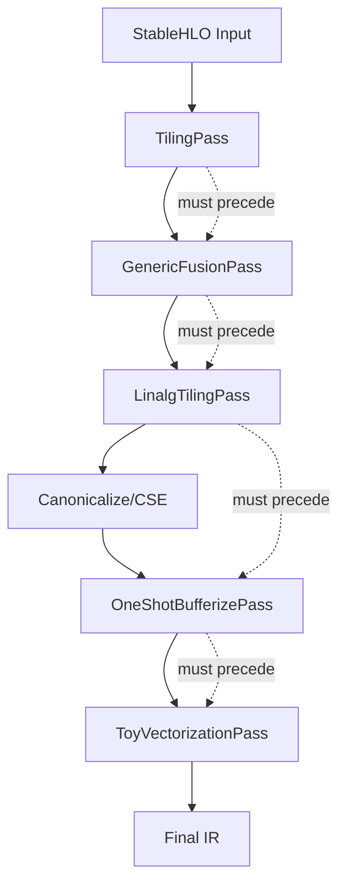

## Introduction

microMLC is a playground compiler that explores MLIR/StableHLO optimization techniques for transformer workloads. The architecture demonstrates modern compiler design principles with a focus on:

- **Progressive lowering** through multiple IR stages
- **Cache-aware transformations** with multi-level tiling
- **Operator fusion** to eliminate intermediate tensors
- **Memory management** via tensor-to-memref bufferization
- **SIMD vectorization** targeting modern CPUs

## Design Principles

### 1. Separation of Concerns

Each compiler pass has a single, well-defined responsibility:

- **TilingPass** converts StableHLO ops to tiled loops
- **GenericFusionPass** merges adjacent elementwise operations
- **LinalgTilingPass** applies cache-conscious blocking
- **OneShotBufferizePass** manages tensor-to-memory conversion
- **ToyVectorizationPass** generates SIMD instructions

Passes are composed into pipelines rather than creating monolithic transformations.

### 2. Safety Through Profitability Analysis

Each pass includes checks to prevent unprofitable or incorrect transformations:

```cpp
// LinalgTilingPass.cpp:22
static LogicalResult checkProfitability(linalg::LinalgOp op, 
                                        ArrayRef<int64_t> tileSizes, 
                                        int64_t minShapeSize) {
  // Verify dimensions are large enough
  // Allow partial tiles for flexibility
  // Prevent re-tiling already transformed code
}
```

Transformations fail gracefully when conditions aren't met, leaving IR unchanged.

### 3. Incremental Lowering

The compiler progressively lowers from high-level to low-level representations:

```
StableHLO (tensor ops)
    ↓
Linalg Generic (structured ops)
    ↓
Tiled Linalg (loop nests + tensors)
    ↓
MemRefs (explicit memory)
    ↓
Vector IR (SIMD operations)
```

Each stage maintains semantic equivalence while exposing optimization opportunities.

### 4. Reusable Infrastructure

All passes are implemented as:
- **TableGen-defined** (`Passes.td`)
- **MLIR PassWrapper subclasses**
- **Registered with stablehlo-opt**

They can be composed in any order and used standalone:

```bash
stablehlo-opt input.mlir \
  -stablehlo-tiling \
  -generic-fusion \
  -canonicalize
```

## Component Relationships

### Source Organization

```
toy-transformer/
├── passes/                 # Core compiler passes (C++)
│   ├── TilingPass.cpp
│   ├── GenericFusionPass.cpp
│   ├── LinalgTilingPass.cpp
│   ├── OneShotBufferizePass.cpp
│   ├── ToyVectorizationPass.cpp
│   ├── Passes.td          # Pass definitions
│   ├── Passes.h           # Registration headers
│   └── CMakeLists.txt     # Build configuration
│
├── ir/                    # Staged IR files
│   ├── attn_complete.mlir         # Input (StableHLO)
│   ├── attn_stage0_linalg.mlir    # After tiling
│   ├── attn_stage1_fused.mlir     # After fusion
│   ├── attn_stage2_tiled_tensor.mlir  # After L2/L1 tiling
│   ├── attn_stage3_bufferized.mlir    # After bufferization
│   └── attn_stage5_vectorized.mlir    # Final vectorized code
│
├── tools/                 # Pipeline scripts
│   ├── run_attn_cache_pipeline.sh  # Main optimization pipeline
│   ├── sync_passes.sh              # Copy passes to StableHLO tree
│   └── benchmark_*.sh              # Performance measurement
│
├── transformer/python/    # IR generation
│   └── gen_mhattn_ir.py   # Generates StableHLO from PyTorch
│
└── third_party/
    └── stablehlo/         # LLVM/MLIR/StableHLO build
```

### Pass Dependencies

The optimization pipeline has strict ordering requirements:



**Critical ordering constraints:**

1. **Fusion before tiling**: Fusing on small tiles is less effective
2. **Bufferization before vectorization**: Vector ops require memref operands
3. **Canonicalization between passes**: Simplifies IR and exposes opportunities

### Dialect Usage

The compiler leverages multiple MLIR dialects:

| Dialect | Purpose | Key Operations |
|---------|---------|----------------|
| **stablehlo** | High-level ML ops | `dot_general`, `transpose`, `reshape` |
| **linalg** | Structured linear algebra | `matmul`, `batch_matmul`, `generic` |
| **scf** | Control flow | `for`, `if`, `yield` |
| **tensor** | Tensor operations | `extract_slice`, `insert_slice`, `empty` |
| **memref** | Memory references | `alloc`, `subview`, `copy` |
| **vector** | SIMD operations | `transfer_read`, `transfer_write`, `contract` |
| **arith** | Arithmetic | `addf`, `mulf`, `cmpf`, `constant` |
| **math** | Mathematical functions | `exp`, `log`, `sqrt` |

## Key Data Structures

### IR Representation

MLIR uses **SSA form** (Static Single Assignment):

```mlir
%0 = linalg.matmul ins(%a, %b : tensor<128x128xf32>, tensor<128x128xf32>) 
                   outs(%c : tensor<128x128xf32>) -> tensor<128x128xf32>
```

Each value is defined exactly once, simplifying analysis and transformation.

### Indexing Maps

Affine maps express how loop iterations access data:

```mlir
#map = affine_map<(d0, d1, d2, d3) -> (d0, d2, d1, d3)>
// Loop dims: (batch, heads, seq, dim)
// Access pattern: (batch, seq, heads, dim) - transpose
```

The compiler reasons about these maps to determine fusion legality and vectorization patterns.

### Attributes

Passes use attributes to track transformation state:

```cpp
// TilingPass.cpp:137
partialOp->setAttr("done_tiling", rewriter.getUnitAttr());
```

This prevents infinite rewrite loops where passes would repeatedly transform the same operations.

## Compilation Workflow

### 1. IR Generation

PyTorch models are exported to StableHLO:

```python
# transformer/python/gen_mhattn_ir.py
module = torch_mlir.compile(
    attention_layer,
    (q, k, v),
    output_type="stablehlo"
)
```

### 2. Pass Execution

The pipeline script applies transformations:

```bash
# Stage 0: Initial tiling
stablehlo-opt -stablehlo-tiling input.mlir -o stage0.mlir

# Stage 1: Operator fusion
stablehlo-opt -generic-fusion stage0.mlir -o stage1.mlir

# Stage 2: Multi-level tiling
stablehlo-opt \
  "-stablehlo-linalg-tiling=l2-tile-sizes=64,64,64 l1-tile-sizes=4,4,4" \
  stage1.mlir -o stage2.mlir

# Stage 3: Bufferization
stablehlo-opt \
  -empty-tensor-to-alloc-tensor \
  -one-shot-bufferize \
  -convert-bufferization-to-memref \
  stage2.mlir -o stage3.mlir

# Stage 5: Vectorization
stablehlo-opt \
  "-toy-vectorize=vector-width=4 enable-reductions" \
  stage3.mlir -o stage5.mlir
```

### 3. Execution

Optimized IR is executed with `mlir-cpu-runner`:

```bash
mlir-cpu-runner stage5.mlir \
  -entry-point-result=void \
  -shared-libs=libmlir_runner_utils.dylib
```

## Performance Characteristics

### Optimization Impact

Each stage provides measurable speedups:

| Stage | Transformation | Typical Speedup |
|-------|----------------|------------------|
| 0 | StableHLO → Linalg | 1.0× (baseline) |
| 1 | Operator Fusion | 1.2-1.5× |
| 2 | Cache Tiling | 2-3× |
| 3 | Bufferization | ~1.0× (enables vectorization) |
| 5 | Vectorization | 2-4× |
| **Total** | **End-to-end** | **5-15×** |

Actual speedups depend on matrix sizes, cache sizes, and CPU architecture.

### Memory Access Patterns

Tiling transforms memory access from:

**Naive (poor locality)**:
```
for i in [0, 128):
  for j in [0, 128):
    for k in [0, 128):
      C[i,j] += A[i,k] * B[k,j]  # Poor cache reuse
```

**Tiled (good locality)**:
```
for i in [0, 128, 64):        # L2 tile
  for j in [0, 128, 64):
    for k in [0, 128, 64):
      for ii in [i, i+64, 4):  # L1 tile
        for jj in [j, j+64, 4):
          for kk in [k, k+64, 4):
            C[ii,jj] += A[ii,kk] * B[kk,jj]  # Excellent reuse
```

## Extension Points

### Adding New Passes

1. Implement `PassWrapper<YourPass, OperationPass<...>>`
2. Define in `Passes.td`
3. Register in `Passes.h`
4. Add to `CMakeLists.txt`
5. Run `tools/sync_passes.sh`

### Targeting New Operations

Most passes use pattern rewriting:

```cpp
struct YourPattern : public OpRewritePattern<TargetOp> {
  LogicalResult matchAndRewrite(TargetOp op, PatternRewriter &rewriter) const override {
    // Transformation logic
    rewriter.replaceOp(op, newResults);
    return success();
  }
};
```

### Adding Pipeline Stages

Create new shell scripts in `tools/` that chain `stablehlo-opt` invocations.

## Related Documentation

- [Pipeline Details](/architecture/pipeline) - Complete pass-by-pass execution
- [IR Stages](/architecture/ir-stages) - Detailed IR transformations with examples
- [Custom Passes](/guides/custom-passes) - Writing and testing new passes
