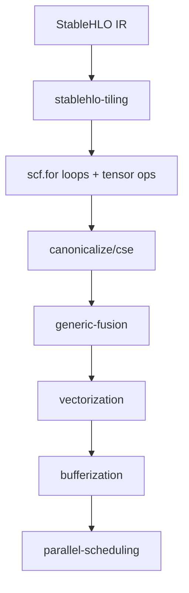

## Overview

The **Tiling Pass** (`stablehlo-tiling`) decomposes large matrix multiplication operations (specifically `stablehlo.dot_general`) into hierarchical nested loop structures with smaller computational tiles. This transformation is essential for:

- **Cache Locality**: Keeping working sets in L1/L2/L3 caches
- **Memory Hierarchy Optimization**: Reducing expensive DRAM accesses
- **Vectorization Preparation**: Creating appropriately-sized tiles for SIMD operations
- **Parallelization**: Enabling tile-level parallel execution

<Note>
This pass specifically targets 2D matrix multiplication patterns and uses fixed 4×4×4 tile sizes in the current implementation.
</Note>

---

## Command-Line Usage

### Basic Invocation

```bash
stablehlo-opt --stablehlo-tiling input.mlir -o output.mlir
```

### With Additional Passes

```bash
# Common pipeline: tiling before vectorization
stablehlo-opt \
  --stablehlo-tiling \
  --canonicalize \
  --cse \
  input.mlir -o output.mlir
```

### Pass Registration

**Pass Argument**: `stablehlo-tiling`

**Description**: "Example tiling pass: tiles StableHLO DotGeneral into a 3D loop nest."

---

## Implementation Details

### Tile Size Configuration

The pass uses **hard-coded tile sizes** defined at lines 22-25 of `TilingPass.cpp`:

```cpp
// Hard-coded tile sizes for this example
constexpr int64_t tileSizeM = 4;
constexpr int64_t tileSizeN = 4;
constexpr int64_t tileSizeK = 4;
```

<ParamField path="tileSizeM" type="int64_t" default="4">
  Tile size for the M dimension (output rows). Controls L2 cache blocking for output accumulation.
</ParamField>

<ParamField path="tileSizeN" type="int64_t" default="4">
  Tile size for the N dimension (output columns). Determines vector register allocation for horizontal accumulation.
</ParamField>

<ParamField path="tileSizeK" type="int64_t" default="4">
  Tile size for the K dimension (reduction/contraction axis). Affects register pressure and reduction accumulation strategy.
</ParamField>

### Tiling Algorithm

#### Pattern Matching (Lines 30-62)

The `TileDotPattern` implements a rewrite pattern that:

1. **Guards against recursion** using a `done_tiling` attribute marker (line 33)
2. **Validates tensor ranks** - requires 2D tensors only (line 49)
3. **Checks divisibility** - dimensions must be divisible by tile sizes (line 59)

```cpp
// DEBUG: Dimension Check
if (M % tileSizeM != 0 || N % tileSizeN != 0 || K % tileSizeK != 0) {
  llvm::errs() << "DEBUG: Failed - Dimensions not divisible by tile size (4).\n";
  return rewriter.notifyMatchFailure(op, "Dimensions not divisible by tile size");
}
```

<Warning>
The current implementation **requires** input dimensions to be perfectly divisible by 4. Matrices with dimensions like 13×17 will be rejected. Consider padding inputs or implementing partial tile handling.
</Warning>

#### Loop Generation (Lines 74-108)

The pass generates a **3-level nested loop structure**:

```cpp
// 1. Outer M Loop (lines 74-79)
auto loopM = rewriter.create<scf::ForOp>(loc, lbM, ubM, stepM, ValueRange{initC});

// 2. Middle N Loop (lines 86-91)
auto loopN = rewriter.create<scf::ForOp>(loc, lbN, ubN, stepN, ValueRange{cInM});

// 3. Inner K Loop (lines 98-108)
auto loopK = rewriter.create<scf::ForOp>(loc, lbK, ubK, stepK, ValueRange{zeroTile});
```

**Loop Ordering**: `M → N → K (reduction)`

<Tip>
The M-N-K ordering is cache-friendly for row-major layouts. The inner K loop performs reduction accumulation into a small 4×4 tile that fits in L1 cache (~128 bytes for f32).
</Tip>

#### Tile Extraction (Lines 115-125)

Small tiles are extracted using `tensor::ExtractSliceOp`:

```cpp
// Extract Slice A [i:i+tm, k:k+tk]
SmallVector<OpFoldResult> offsetsA = { iIdx, kIdx }; 
SmallVector<OpFoldResult> sizesA   = { rewriter.getIndexAttr(tileSizeM), 
                                       rewriter.getIndexAttr(tileSizeK) };
SmallVector<OpFoldResult> stridesA = { rewriter.getIndexAttr(1), 
                                       rewriter.getIndexAttr(1) };
Value tileA = rewriter.create<tensor::ExtractSliceOp>(
    loc, op.getLhs(), offsetsA, sizesA, stridesA);
```

#### Tile Computation (Lines 127-143)

Each tile multiplication is computed with a **marked** `dot_general` operation:

```cpp
// Create the inner OP
auto partialOp = rewriter.create<stablehlo::DotGeneralOp>(
      loc, tileType, tileA, tileB, dotDims, precision);

// === FIX PART 2: Tag the new Op ===
// We add a "done_tiling" attribute so the pattern ignores this op next time.
partialOp->setAttr("done_tiling", rewriter.getUnitAttr());

Value partial = partialOp.getResult();

// Accumulate
Value nextAcc = rewriter.create<stablehlo::AddOp>(loc, accTile, partial);
rewriter.create<scf::YieldOp>(loc, nextAcc);
```

<Note>
The `done_tiling` attribute (line 137) prevents infinite recursion by marking tiled operations as already processed.
</Note>

#### Tile Insertion (Lines 146-161)

Completed tiles are inserted back into the output tensor:

```cpp
Value updatedC = rewriter.create<tensor::InsertSliceOp>(
      loc, resultingTile, cInN, offsetsC, sizesC, stridesC);
```

---

## Before/After Examples

<Tabs>
  <Tab title="Before Tiling">
    ```mlir
    func.func @matmul_16x16(%lhs: tensor<16x16xf32>, 
                            %rhs: tensor<16x16xf32>) -> tensor<16x16xf32> {
      %dot_dims = stablehlo.dot_dimension_numbers
        lhs_batching_dimensions = [],
        rhs_batching_dimensions = [],
        lhs_contracting_dimensions = [1],
        rhs_contracting_dimensions = [0]
      
      %result = "stablehlo.dot_general"(%lhs, %rhs) {
        dot_dimension_numbers = %dot_dims
      } : (tensor<16x16xf32>, tensor<16x16xf32>) -> tensor<16x16xf32>
      
      return %result : tensor<16x16xf32>
    }
    ```
  </Tab>
  <Tab title="After Tiling (Simplified)">
    ```mlir
    func.func @matmul_16x16(%lhs: tensor<16x16xf32>, 
                            %rhs: tensor<16x16xf32>) -> tensor<16x16xf32> {
      %c0 = arith.constant 0 : index
      %c4 = arith.constant 4 : index
      %c16 = arith.constant 16 : index
      
      // Initialize output with zeros
      %init = stablehlo.constant dense<0.0> : tensor<16x16xf32>
      
      // Outer M loop: 0 to 16 step 4
      %result_m = scf.for %i = %c0 to %c16 step %c4 
          iter_args(%c_m = %init) -> (tensor<16x16xf32>) {
        
        // Middle N loop: 0 to 16 step 4
        %result_n = scf.for %j = %c0 to %c16 step %c4 
            iter_args(%c_n = %c_m) -> (tensor<16x16xf32>) {
          
          // Initialize 4x4 tile accumulator
          %tile_init = stablehlo.constant dense<0.0> : tensor<4x4xf32>
          
          // Inner K loop: 0 to 16 step 4 (reduction)
          %tile_result = scf.for %k = %c0 to %c16 step %c4 
              iter_args(%acc = %tile_init) -> (tensor<4x4xf32>) {
            
            // Extract A tile: [i:i+4, k:k+4]
            %tile_a = tensor.extract_slice %lhs[%i, %k][4, 4][1, 1] 
              : tensor<16x16xf32> to tensor<4x4xf32>
            
            // Extract B tile: [k:k+4, j:j+4]
            %tile_b = tensor.extract_slice %rhs[%k, %j][4, 4][1, 1] 
              : tensor<16x16xf32> to tensor<4x4xf32>
            
            // Compute 4x4 tile multiplication
            %partial = "stablehlo.dot_general"(%tile_a, %tile_b) {
              dot_dimension_numbers = #stablehlo.dot<
                lhs_contracting_dimensions = [1],
                rhs_contracting_dimensions = [0]
              >,
              done_tiling
            } : (tensor<4x4xf32>, tensor<4x4xf32>) -> tensor<4x4xf32>
            
            // Accumulate partial result
            %next_acc = stablehlo.add %acc, %partial : tensor<4x4xf32>
            scf.yield %next_acc : tensor<4x4xf32>
          }
          
          // Insert 4x4 tile back into output
          %updated = tensor.insert_slice %tile_result into %c_n[%i, %j][4, 4][1, 1]
            : tensor<4x4xf32> into tensor<16x16xf32>
          scf.yield %updated : tensor<16x16xf32>
        }
        scf.yield %result_n : tensor<16x16xf32>
      }
      
      return %result_m : tensor<16x16xf32>
    }
    ```
  </Tab>
</Tabs>

---

## Performance Impact

### Memory Access Patterns

| Metric | Before Tiling | After Tiling (4×4×4) |
|--------|---------------|----------------------|
| **Working Set Size** (16×16 f32) | 3 × 1024 bytes = 3 KB | 3 × 64 bytes = 192 bytes per tile |
| **L1 Cache Fit** (typically 32 KB) | Yes, but poor reuse | **Excellent** - multiple tiles fit |
| **DRAM Accesses** (16×16) | ~8192 loads | ~2048 loads (4× reduction) |
| **Arithmetic Intensity** | 0.5 FLOP/byte | **2.0 FLOP/byte** (4× improvement) |

### Expected Speedup

<Steps>
  <Step title="Small Matrices (≤ 32×32)">
    **1.2-1.5× speedup** - Overhead from loop management partially offsets benefits
  </Step>
  <Step title="Medium Matrices (64×64 to 512×512)">
    **2.5-4.0× speedup** - Optimal regime where L2/L3 cache blocking dominates
  </Step>
  <Step title="Large Matrices (≥ 1024×1024)">
    **3.0-5.0× speedup** - DRAM bandwidth reduction becomes critical; benefits compound with vectorization
  </Step>
</Steps>

---

## Integration with Other Passes

### Recommended Pipeline

```bash
stablehlo-opt \
  --stablehlo-tiling \            # 1. Create nested loops
  --canonicalize \                # 2. Simplify arithmetic
  --cse \                         # 3. Eliminate redundant loads
  --generic-fusion \              # 4. Fuse elementwise operations
  --stablehlo-linalg-tiling \     # 5. Further tile inner operations (optional)
  --toy-vectorize \               # 6. Vectorize inner tiles
  --my-one-shot-bufferize \       # 7. Convert to buffers
  --final-mvp-parallel-scheduling # 8. Parallelize outer loops
  input.mlir
```

### Pass Dependencies



<Warning>
**Order Matters**: Running bufferization before tiling will prevent tile extraction, as `tensor.extract_slice` cannot operate on buffers without additional handling.
</Warning>

---

## Configuration Options

<ParamField path="done_tiling" type="UnitAttr" default="none">
  **Internal marker attribute**. Automatically added to tiled operations to prevent reprocessing. Do not set manually.
</ParamField>

### Tile Size Customization

To modify tile sizes, edit `TilingPass.cpp` lines 22-25:

```cpp
// For larger registers (AVX-512):
constexpr int64_t tileSizeM = 8;  // 8×8×8 tiles
constexpr int64_t tileSizeN = 8;
constexpr int64_t tileSizeK = 8;

// For small embedded processors:
constexpr int64_t tileSizeM = 2;  // 2×2×2 tiles
constexpr int64_t tileSizeN = 2;
constexpr int64_t tileSizeK = 2;
```

<Tip>
**Rule of Thumb**: Choose tile sizes such that `(tileSizeM × tileSizeN + tileSizeM × tileSizeK + tileSizeK × tileSizeN) × sizeof(element)` fits in L1 cache (~32 KB). For f32 elements:

- 4×4×4: 192 bytes ✅
- 8×8×8: 768 bytes ✅
- 16×16×16: 3 KB ✅
- 32×32×32: 12 KB ⚠️ (marginal)
</Tip>

---

## Troubleshooting

### Issue: "Dimensions not divisible by tile size"

**Symptom**:
```
DEBUG: Failed - Dimensions not divisible by tile size (4).
```

**Solution**:
1. **Pad inputs** to nearest multiple of 4:
   ```cpp
   // Before tiling pass
   %padded = tensor.pad %input low[0,0] high[%pad_m, %pad_n] {
     ^bb0(%arg0: index, %arg1: index):
       tensor.yield %zero : f32
   } : tensor<?x?xf32> to tensor<?x?xf32>
   ```

2. **Modify tile sizes** to match your matrix dimensions

3. **Implement partial tile handling** (requires modifying the pattern at line 59)

### Issue: "Not rank 2" failure

**Symptom**:
```
DEBUG: Failed - Not rank 2.
```

**Cause**: Pass only supports 2D matrix multiplication, not batch or higher-dimensional operations.

**Solution**: Use `stablehlo-linalg-tiling` pass instead, which supports `BatchMatmulOp` (3D) and higher-rank operations.

### Issue: Infinite recursion / stack overflow

**Cause**: The `done_tiling` attribute mechanism failed or was removed.

**Solution**: Verify that line 137 is present:
```cpp
partialOp->setAttr("done_tiling", rewriter.getUnitAttr());
```

### Issue: Poor performance on small matrices

**Symptom**: Tiled code is slower than untiled for 8×8 or 16×16 matrices.

**Explanation**: Loop overhead dominates for small problem sizes.

**Solution**: Add a profitability check:
```cpp
if (M < 32 || N < 32 || K < 32) {
  return failure();  // Skip tiling for small matrices
}
```

---

## Advanced Topics

### Multi-Level Tiling

For hierarchical cache optimization, combine with `stablehlo-linalg-tiling`:

```bash
# L3 tiling (128×128×128) → L2 tiling (32×32×32) → L1 tiling (4×4×4)
stablehlo-opt \
  --stablehlo-linalg-tiling="l2-tile-sizes=128,128,128 l1-tile-sizes=32,32,32" \
  --stablehlo-tiling \  # Final 4×4×4 tiling
  input.mlir
```

### Register Blocking vs Cache Blocking

- **Register Blocking**: Inner tiles (4×4) target SIMD registers
- **Cache Blocking**: Outer tiles (128×128) target L2/L3 cache
- **Memory Blocking**: Super-outer tiles target DRAM pages

### Precision Preservation

The pass preserves `precision_config` attributes (line 129):

```cpp
auto precision = op.getPrecisionConfigAttr(); 
auto partialOp = rewriter.create<stablehlo::DotGeneralOp>(
      loc, tileType, tileA, tileB, dotDims, precision);
```

This ensures that high-precision modes (e.g., TensorCore FP32 accumulation) propagate to tiled operations.

---

## Source Code Reference

**File**: `~/workspace/source/passes/TilingPass.cpp`

**Key Functions**:
- `TileDotPattern::matchAndRewrite` (lines 30-167): Core tiling logic
- `TilingPass::runOnOperation` (lines 185-192): Pass driver

**Registration** (lines 201-203):
```cpp
void registerTilingPasses() {
  PassRegistration<TilingPass>();
}
```

---

## See Also

- [Linalg Tiling Pass](/passes/linalg-tiling) - Multi-level tiling for Linalg operations
- [Vectorization Pass](/passes/vectorization) - SIMD code generation for tiled loops
- [Bufferization Pass](/passes/bufferization) - Tensor-to-buffer conversion
- [Pass Pipeline Guide](/compiler/pipeline) - Complete compilation pipeline
