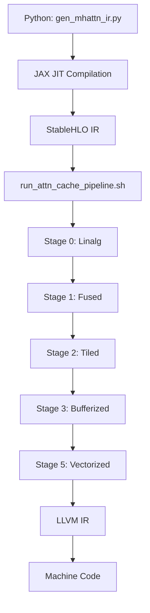

## Overview

The `transformer/python/` directory contains JAX implementations of transformer components that compile to StableHLO intermediate representation. These models serve as the source programs for microMLC's compilation pipeline.

## Directory Structure

```
transformer/python/
├── gen_mhattn_ir.py          # Main IR generator
├── selfattention.py         # Multi-head attention implementations
├── layers.py                # Transformer blocks (encoder/decoder)
├── embeddings.py            # Token embeddings and RoPE
├── compilerpass_selfatt.py  # Debug utilities for IR inspection
├── data.py                  # Data preprocessing
├── tokenizer.py             # GPT-2 tokenizer wrapper
├── testing_fwdpass.py       # Forward pass tests
└── testing_training.py      # Training loop tests
```

---

## IR Generation: gen_mhattn_ir.py

### Purpose

Generates StableHLO IR for unmasked multi-head attention by:
1. Defining attention in JAX
2. JIT-compiling with `jax.jit`
3. Lowering to StableHLO dialect
4. Extracting and saving MLIR text

### Complete Source

```python
import jax
import jax.numpy as jnp
from jax import random

def multihead_attn(x: jnp.ndarray,
                   W_q: jnp.ndarray,
                   W_k: jnp.ndarray,
                   W_v: jnp.ndarray) -> jnp.ndarray:
    
    # --- Dimensions ---
    # x: (Batch, Seq, D_Model)
    batch_size, seq_len, d_model = x.shape
    
    # We choose 4 heads. 
    # If d_model is 128, head_dim will be 32.
    num_heads = 4 
    head_dim = d_model // num_heads

    # 1. Linear Projections
    # Shapes: (Batch, Seq, Dim) @ (Dim, Dim) -> (Batch, Seq, Dim)
    Q = jnp.dot(x, W_q)
    K = jnp.dot(x, W_k)
    V = jnp.dot(x, W_v)

    # 2. Split Heads
    # Reshape: (Batch, Seq, Heads, HeadDim)
    Q = Q.reshape(batch_size, seq_len, num_heads, head_dim)
    K = K.reshape(batch_size, seq_len, num_heads, head_dim)
    V = V.reshape(batch_size, seq_len, num_heads, head_dim)

    # Transpose to (Batch, Heads, Seq, HeadDim)
    # This aligns memory for the dot product
    Q = Q.transpose(0, 2, 1, 3)
    K = K.transpose(0, 2, 1, 3)
    V = V.transpose(0, 2, 1, 3)

    # 3. Scaled Dot-Product Attention (No Mask)
    # (Batch, Heads, Seq, HeadDim) @ (Batch, Heads, HeadDim, Seq) -> (Batch, Heads, Seq, Seq)
    # We swap the last two dims of K to transpose it
    scores = jnp.matmul(Q, K.swapaxes(-2, -1)) / jnp.sqrt(head_dim)

    # 4. Softmax
    weights = jax.nn.softmax(scores, axis=-1)
    
    # 5. Aggregate Values
    # (Batch, Heads, Seq, Seq) @ (Batch, Heads, Seq, HeadDim) -> (Batch, Heads, Seq, HeadDim)
    out = jnp.matmul(weights, V)

    # 6. Recombine Heads
    # Transpose back to (Batch, Seq, Heads, HeadDim)
    out = out.transpose(0, 2, 1, 3)
    # Reshape to (Batch, Seq, D_Model)
    out = out.reshape(batch_size, seq_len, d_model)

    return out

def main():
    print("Generating IR for Standard (Unmasked) Multi-Head Attention...")

    # 1. Setup Inputs
    key = random.PRNGKey(0)
    batch = 1
    seq = 128
    d_model = 128
    
    x = random.normal(key, (batch, seq, d_model))
    
    k1, k2, k3 = random.split(key, 3)
    W_q = random.normal(k1, (d_model, d_model))
    W_k = random.normal(k2, (d_model, d_model))
    W_v = random.normal(k3, (d_model, d_model))
    
    # 2. Lower to StableHLO
    f_jit = jax.jit(multihead_attn)
    lowered = f_jit.lower(x, W_q, W_k, W_v)

    # === FIX START ===
    ir_module = lowered.compiler_ir(dialect="stablehlo")
    
    # Robustly get text for any JAX version
    try:
        # Newer JAX / MLIR bindings often just use str()
        stablehlo_txt = str(ir_module)
        # If it returns a simplified object representation, try specific methods
        if "module" not in stablehlo_txt and hasattr(ir_module, "operation"):
             stablehlo_txt = ir_module.operation.get_asm()
    except Exception:
        # Fallback for older versions
        stablehlo_txt = ir_module.as_text()
    # === FIX END ===

    # 3. Save to File
    filename = "attn_unmasked.mlir"
    with open(filename, "w") as f:
        f.write(stablehlo_txt)
    
    print(f"Success! Written to '{filename}'")

if __name__ == "__main__":
    main()
```

### Key Functions

#### `multihead_attn(x, W_q, W_k, W_v)`

Implements standard scaled dot-product attention:

1. **Linear projections**: `Q = x @ W_q`, `K = x @ W_k`, `V = x @ W_v`
2. **Head splitting**: Reshape `(B, S, D)` → `(B, S, H, D_h)` → `(B, H, S, D_h)`
3. **Attention scores**: `scores = Q @ Kᵀ / √(D_h)`
4. **Softmax**: `weights = softmax(scores, axis=-1)`
5. **Context aggregation**: `out = weights @ V`
6. **Head recombination**: `(B, H, S, D_h)` → `(B, S, H, D_h)` → `(B, S, D)`

#### Lowering Pipeline

```python
f_jit = jax.jit(multihead_attn)          # Create JIT-compiled version
lowered = f_jit.lower(x, W_q, W_k, W_v)  # Lower to compiler IR
ir_module = lowered.compiler_ir(dialect="stablehlo")  # Get StableHLO IR
stablehlo_txt = str(ir_module)            # Extract text representation
```

### Usage

```bash
cd transformer/python
python gen_mhattn_ir.py
```

**Output**: `attn_unmasked.mlir` (StableHLO module)

**Typical size**: ~15KB, ~300 lines of MLIR

---

## Self-Attention: selfattention.py

### Purpose

Defines multiple attention variants for experimentation:
- Standard multi-head attention
- Masked (causal) attention for decoder
- Cross-attention for encoder-decoder

### Key Components

#### Multi-Head Attention (Unmasked)

```python
@jax.jit
def multihead_attn(q_input: jnp.ndarray,
                   kv_input: jnp.ndarray,
                   W_q: jnp.ndarray,
                   W_k: jnp.ndarray,
                   W_v: jnp.ndarray) -> jnp.ndarray:
    # infer dimensions from input tensors
    batch_size, q_len, d_model = q_input.shape
    num_heads = 4
    head_dim = d_model // num_heads

    # linear projections
    Q = q_input @ W_q
    K = kv_input @ W_k
    V = kv_input @ W_v

    _, kv_len, _ = K.shape

    # reshape into heads: (batch, heads, seq_len, head_dim)
    Q = Q.reshape(batch_size, q_len, num_heads, head_dim).transpose(0, 2, 1, 3)
    K = K.reshape(batch_size, kv_len, num_heads, head_dim).transpose(0, 2, 1, 3)
    V = V.reshape(batch_size, kv_len, num_heads, head_dim).transpose(0, 2, 1, 3)

    # scaled dot-product attention
    scores = jnp.matmul(Q, K.swapaxes(-2, -1)) / jnp.sqrt(head_dim)
    weights = jax.nn.softmax(scores, axis=-1)

    out = jnp.matmul(weights, V)
    out = out.transpose(0, 2, 1, 3).reshape(batch_size, q_len, d_model)

    return out
```

**Difference from `gen_mhattn_ir.py`**: Accepts separate `q_input` and `kv_input` for cross-attention.

#### Masked Multi-Head Attention (Causal)

```python
def masked_multihead_attn(x: jnp.ndarray,
                          W_q: jnp.ndarray,
                          W_k: jnp.ndarray,
                          W_v: jnp.ndarray,
                          mask: jnp.ndarray) -> jnp.ndarray:
    batch_size, seq_len, d_model = x.shape
    num_heads = 4
    head_dim = d_model // num_heads

    Q = x @ W_q
    K = x @ W_k
    V = x @ W_v

    # reshape into heads: (batch, heads, seq, head_dim)
    Q = Q.reshape(batch_size, seq_len, num_heads, head_dim).transpose(0, 2, 1, 3)
    K = K.reshape(batch_size, seq_len, num_heads, head_dim).transpose(0, 2, 1, 3)
    V = V.reshape(batch_size, seq_len, num_heads, head_dim).transpose(0, 2, 1, 3)

    # scaled dot-product attention
    scores = jnp.matmul(Q, K.swapaxes(-2, -1)) / jnp.sqrt(head_dim)

    # broadcast mask to (batch=1, heads=1, seq, seq)
    mask = mask[None, None, :, :]
    scores = jnp.where(mask, scores, -1e9)  # mask out future tokens

    weights = jax.nn.softmax(scores, axis=-1)

    out = jnp.matmul(weights, V)
    out = out.transpose(0, 2, 1, 3).reshape(batch_size, seq_len, d_model)

    return out
```

**Mask generation**:
```python
mask = jnp.tril(jnp.ones((seq_len, seq_len), dtype=bool))
# [[True, False, False, False],
#  [True, True,  False, False],
#  [True, True,  True,  False],
#  [True, True,  True,  True ]]
```

---

## Transformer Layers: layers.py

### Purpose

Defines complete encoder and decoder blocks using attention as a building primitive.

### Encoder Block

```python
class EncoderBlock: 
    def __init__(self, d_model:int, d_ff:int, num_heads:int, key:jax.Array):
        k1, k2, k3, k_ff = random.split(key, 4)
        self.ln1 = LayerNorm(d_model)
        self.ln2 = LayerNorm(d_model)
        
        self.W_q = random.normal(k1, (d_model, d_model)) * jnp.sqrt(2.0 / d_model)
        self.W_k = random.normal(k2, (d_model, d_model)) * jnp.sqrt(2.0 / d_model)
        self.W_v = random.normal(k3, (d_model, d_model)) * jnp.sqrt(2.0 / d_model)
        
        self.ffnn = FeedForwardNN(d_model, d_ff, k_ff)
        
        self.d_model = d_model
        self.num_heads = num_heads
    
    def __call__(self, x): 
        # Pre-norm architecture (LayerNorm before attention)
        x_norm = self.ln1(x)
        attn_out = multihead_attn(x_norm, x_norm, self.W_q, self.W_k, self.W_v)
        x = x + attn_out  # Residual connection
        
        x_norm2 = self.ln2(x)
        ffn_out = self.ffnn(x_norm2)
        x = x + ffn_out   # Residual connection
        return x
```

**Architecture**: Pre-LayerNorm + Multi-Head Attention + Residual + Pre-LayerNorm + FFN + Residual

### Decoder Block

```python
class DecoderBlock:
    def __init__(self, d_model:int, d_ff:int, num_heads:int, key:jax.Array):
        k1, k2, k3, k4, k5, k6, k_ff = random.split(key, 7) 
        
        # Masked self-attention weights
        self.Wq_mask = random.normal(k1, (d_model, d_model)) * jnp.sqrt(2.0 / d_model)
        self.Wk_mask = random.normal(k2, (d_model, d_model)) * jnp.sqrt(2.0 / d_model)
        self.Wv_mask = random.normal(k3, (d_model, d_model)) * jnp.sqrt(2.0 / d_model)

        # Cross-attention weights
        self.Wq_cross = random.normal(k4, (d_model, d_model)) * jnp.sqrt(2.0 / d_model)
        self.Wk_cross = random.normal(k5, (d_model, d_model)) * jnp.sqrt(2.0 / d_model)
        self.Wv_cross = random.normal(k6, (d_model, d_model)) * jnp.sqrt(2.0 / d_model)

        self.ffnn = FeedForwardNN(d_model, d_ff, k_ff)
        self.ln1 = LayerNorm(d_model)
        self.ln2 = LayerNorm(d_model)
        self.ln3 = LayerNorm(d_model)
        
    def __call__(self, x, enc_out):
        batch_size, seq_len, _ = x.shape
        
        # 1. Masked self-attention (causal)
        mask = jnp.tril(jnp.ones((seq_len, seq_len), dtype=bool))
        x1 = self.ln1(x)
        m_attn_out = masked_multihead_attn(x1, self.Wq_mask, self.Wk_mask, self.Wv_mask, mask)
        x = x + m_attn_out
        
        # 2. Cross-attention (attend to encoder)
        x2 = self.ln2(x)
        c_attn_out = multihead_attn(x2, enc_out, self.Wq_cross, self.Wk_cross, self.Wv_cross)
        x = x + c_attn_out
        
        # 3. Feed-forward
        x3 = self.ln3(x)
        x = x + self.ffnn(x3)
        
        return x
```

### Feed-Forward Network

```python
class FeedForwardNN: 
    def __init__(self, d_model:int, d_ff:int, key:jax.Array):
        k1, k2, k3, k4 = random.split(key, 4)
        self.W1 = random.normal(k1, (d_model, d_ff)) * jnp.sqrt(2/d_model)
        self.W2 = random.normal(k2, (d_ff, d_model)) * jnp.sqrt(2/d_ff)
        self.B1 = jnp.zeros((d_ff,))
        self.B2 = jnp.zeros((d_model,))

    def __call__(self, x):
        layer1 = (x @ self.W1) + self.B1
        layer2 = relu(layer1)
        layer3 = (layer2 @ self.W2) + self.B2
        return layer3
```

**Structure**: Linear(d_model → d_ff) + ReLU + Linear(d_ff → d_model)

**Typical ratio**: `d_ff = 4 * d_model` (e.g., 512 → 2048 → 512)

### Layer Normalization

```python
class LayerNorm: 
    def __init__(self, dim, eps=1e-5): 
        self.eps = eps 
        self.gamma = jnp.ones((dim,))
        self.beta = jnp.zeros((dim,))

    def __call__(self, x):
        mean = jnp.mean(x, axis=-1, keepdims=True)
        var = jnp.var(x, axis=-1, keepdims=True)
        x_norm = (x - mean) / jnp.sqrt(var + self.eps)
        out = self.gamma * x_norm + self.beta
        return out
```

**Normalization**: Across feature dimension (not batch or sequence)

---

## Embeddings: embeddings.py

### Token Embeddings

```python
def make_embeddings(key: jax.Array, vocab_size: int = 50257, d_model: int = 512) -> jnp.ndarray:
    return random.normal(key, (vocab_size, d_model))

def embed_tokens(embedding_matrix: jnp.ndarray, tokens_id: jnp.ndarray) -> jnp.ndarray: 
    return embedding_matrix[tokens_id]
```

**Usage**:
```python
key = random.PRNGKey(0)
emb_matrix = make_embeddings(key, vocab_size=50257, d_model=512)  # (50257, 512)
tokens = jnp.array([464, 318, 257, 1332])  # "This is a test"
embedded = embed_tokens(emb_matrix, tokens)  # (4, 512)
```

### Rotary Position Embeddings (RoPE)

RoPE applies rotation to Q and K based on position, preserving relative position information.

#### Precompute Rotation Matrices

```python
def precompute_rope(max_seq_len: int, d_model: int) -> Tuple[jnp.ndarray, jnp.ndarray]: 
    assert d_model % 2 == 0 
    dim_half = d_model // 2 

    dim_indices = jnp.arange(0, dim_half)
    freqs = 1.0 / 10000**(dim_indices * 2 / d_model)

    positions = jnp.arange(max_seq_len)
    theta = positions[:, None] * freqs[None, :]  # (max_seq_len, dim_half)
    
    cos = jnp.cos(theta)  # (max_seq_len, dim_half)
    sin = jnp.sin(theta)  # (max_seq_len, dim_half)
    return cos, sin
```

**Frequency formula**: `f_i = 1 / 10000^(2i/d)`

**Result**: Precomputed cos/sin tables for all positions

#### Apply Rotation

```python
def rotate_pairs_jax(x: jnp.ndarray, cos: jnp.ndarray, sin: jnp.ndarray) -> jnp.ndarray:
    orig_shape = x.shape
    d_model = orig_shape[-1]
    dim_half = d_model // 2

    # Reshape into pairs: (..., seq_len, dim_half, 2)
    x_pairs = x.reshape(*orig_shape[:-1], dim_half, 2)

    # Split the pairs
    x1, x2 = x_pairs[..., 0], x_pairs[..., 1]  # (..., seq_len, dim_half)

    # Rotation: [x1', x2'] = [[cos, -sin], [sin, cos]] @ [x1, x2]
    x1_new = x1 * cos - x2 * sin
    x2_new = x1 * sin + x2 * cos

    # Stack and reshape back
    x_rot = jnp.stack([x1_new, x2_new], axis=-1)
    return x_rot.reshape(orig_shape)

def apply_rope(x: jnp.ndarray, cos: jnp.ndarray, sin: jnp.ndarray) -> jnp.ndarray:
    seq_len = x.shape[-2]
    cos_slice = cos[:seq_len]
    sin_slice = sin[:seq_len]
    return rotate_pairs_jax(x, cos_slice, sin_slice)
```

**Mathematics**:

For each pair of dimensions `(x_{2i}, x_{2i+1})` at position `m`:

```
[x'_{2i}  ]   [cos(mθ_i)  -sin(mθ_i)] [x_{2i}  ]
[x'_{2i+1}] = [sin(mθ_i)   cos(mθ_i)] [x_{2i+1}]
```

This rotation preserves the dot product's dependency on relative position.

---

## Tokenizer: tokenizer.py

Wraps Hugging Face's GPT-2 tokenizer:

```python
from transformers import AutoTokenizer

def load_tokenizer(model_name="gpt2"):
    tokenizer = AutoTokenizer.from_pretrained(model_name)
    return tokenizer

if __name__ == "__main__":
    tokenizer = load_tokenizer("gpt2")
    text = "Using a Transformer network is simple"
    encoded = tokenizer.encode(text)
    decoded = tokenizer.decode(encoded)
    
    print("Original text:", text)
    print("Token IDs:", encoded)
    print("Decoded text:", decoded)
    print(f"Vocabulary size: {tokenizer.vocab_size}")  # 50257
```

**Output**:
```
Original text: Using a Transformer network is simple
Token IDs: [12814, 257, 3602, 16354, 3127, 318, 2829]
Decoded text: Using a Transformer network is simple
Vocabulary size: 50257
```

---

## Data Utilities: data.py

Prepares next-token prediction pairs:

```python
from typing import Tuple, List

def make_next_token_pair(tokenizer, text: str, max_len: int) -> Tuple[List[int], List[int]]:
    ids = tokenizer.encode(text, add_special_tokens=False)

    if len(ids) < 2: 
        ids = ids + [tokenizer.eos_token_id]
    
    input_ids = ids[:-1]  # All tokens except last
    tgt_ids = ids[1:]     # All tokens except first

    # Pad to max_len
    if len(input_ids) > max_len:
        input_ids = input_ids[:max_len]
    else:
        input_ids = input_ids + [tokenizer.eos_token_id] * (max_len - len(input_ids))

    if len(tgt_ids) > max_len:
        tgt_ids = tgt_ids[:max_len]
    else:
        tgt_ids = tgt_ids + [tokenizer.eos_token_id] * (max_len - len(tgt_ids))

    return input_ids, tgt_ids
```

**Usage**:
```python
input_ids, tgt_ids = make_next_token_pair(tokenizer, "Hello world", max_len=8)
# input_ids: [15496, 995, <eos>, <eos>, <eos>, <eos>, <eos>, <eos>]
# tgt_ids:   [995, <eos>, <eos>, <eos>, <eos>, <eos>, <eos>, <eos>]
```

---

## Compiler Pass Inspection: compilerpass_selfatt.py

Utility for debugging lowering process:

```python
import jax
import jax.numpy as jnp
from jax import random
from selfattention import masked_multihead_attn

def main():
    # Dummy inputs
    key = random.PRNGKey(0)
    x    = random.normal(key, (1, 4, 8))   # (batch, seq, d_model)
    W_q  = random.normal(key, (8, 8))
    W_k  = random.normal(key, (8, 8))
    W_v  = random.normal(key, (8, 8))
    mask = jnp.ones((4, 4), dtype=bool)

    f = jax.jit(masked_multihead_attn)

    # Print JAXPR (high-level JAX IR)
    print("\n=== JAXPR ===")
    print(jax.make_jaxpr(masked_multihead_attn)(x, W_q, W_k, W_v, mask))

    # Print StableHLO (compiler IR)
    lowered = f.lower(x, W_q, W_k, W_v, mask)
    try:
        stablehlo_txt = lowered.compiler_ir(dialect="stablehlo").as_text()
    except AttributeError:
        stablehlo_txt = lowered.compiler_ir(dialect="stablehlo").operation.get_asm()

    print("\n=== StableHLO ===")
    print(stablehlo_txt)

    with open("attn.mlir", "w") as f_out:
        f_out.write(stablehlo_txt)
    print("Wrote StableHLO to attn.mlir")

if __name__ == "__main__":
    main()
```

**Output**: JAXPR and StableHLO printed to console, MLIR saved to `attn.mlir`

---

## Workflow Summary

### From Python to Optimized Binary



### Key Transformations

1. **JAX → JAXPR**: Traces Python to functional IR
2. **JAXPR → StableHLO**: Lowers to portable tensor IR
3. **StableHLO → Linalg**: Converts to structured ops
4. **Linalg → Loops**: Tiles and bufferizes
5. **Loops → Vectors**: SIMD code generation
6. **Vectors → LLVM**: Target-specific codegen

---

## Development Tips

### Debugging IR Generation

Inspect intermediate stages:
```python
print(jax.make_jaxpr(multihead_attn)(x, W_q, W_k, W_v))  # High-level IR
print(lowered.compiler_ir(dialect="stablehlo"))           # StableHLO
print(lowered.compiler_ir())                              # Default (often HLO)
```

### Testing Numerical Correctness

```python
import numpy as np

# Reference implementation
out_ref = multihead_attn(x, W_q, W_k, W_v)

# JIT-compiled version
out_jit = jax.jit(multihead_attn)(x, W_q, W_k, W_v)

# Check correctness
assert np.allclose(out_ref, out_jit, atol=1e-5)
```

### Modifying Attention

To experiment with different attention mechanisms:

1. Edit `selfattention.py`
2. Update `gen_mhattn_ir.py` to import new function
3. Regenerate IR: `python gen_mhattn_ir.py`
4. Run pipeline: `./tools/run_attn_cache_pipeline.sh`
5. Benchmark: `./tools/benchmark_all_stages.sh`

---

## Requirements

```bash
pip install jax jaxlib transformers numpy
```

**JAX version**: Tested with JAX 0.4.x (StableHLO export available)

**Hardware**: CPU or GPU (GPU not required for IR generation)

---

## Related

- [IR Examples](./ir-examples) - See the generated StableHLO IR
- [Pipeline Script](./pipeline-script) - Processes the IR
- [Benchmark Scripts](./benchmark-scripts) - Measures performance
