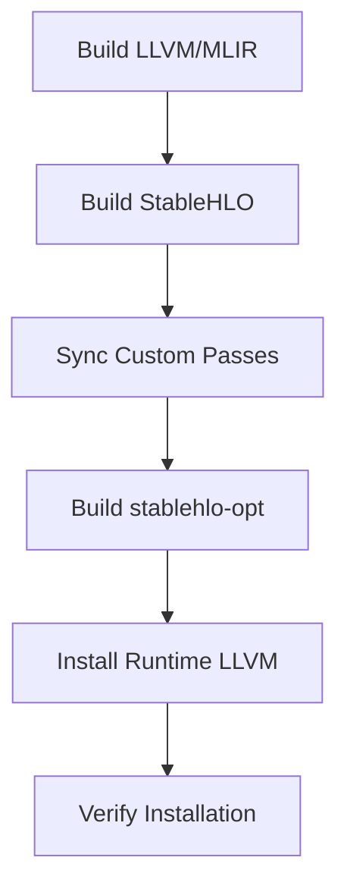

## Overview

Building microMLC involves three main steps: building LLVM/MLIR from source, building StableHLO with custom passes, and installing runtime dependencies. This guide provides detailed instructions for each step.

<Note>
**Build Time Estimate**: Complete build process takes 60-90 minutes on modern hardware (M1/M2 Mac or equivalent).
</Note>

## Prerequisites

Before building, ensure you have:

1. ✅ Completed the [Installation](/setup/installation) steps
2. ✅ Verified all [Dependencies](/setup/dependencies) are installed
3. ✅ At least 30GB of free disk space
4. ✅ CMake, Ninja, and C++ compiler available

## Build Process Overview

The build follows this sequence:



## Step 1: Build LLVM/MLIR

### Configure LLVM Build

Configure the LLVM build with MLIR enabled:

```bash
cmake -S third_party/stablehlo/llvm-project/llvm \
  -B third_party/stablehlo/llvm-project/build \
  -G Ninja \
  -DLLVM_ENABLE_PROJECTS=mlir \
  -DLLVM_TARGETS_TO_BUILD=host \
  -DCMAKE_BUILD_TYPE=Release
```

### Configuration Options Explained

| Option | Value | Purpose |
|--------|-------|----------|
| `-S` | `third_party/stablehlo/llvm-project/llvm` | Source directory |
| `-B` | `third_party/stablehlo/llvm-project/build` | Build directory |
| `-G Ninja` | Use Ninja generator | Faster parallel builds |
| `-DLLVM_ENABLE_PROJECTS=mlir` | Only build MLIR | Reduces build time |
| `-DLLVM_TARGETS_TO_BUILD=host` | Only host target | Faster builds |
| `-DCMAKE_BUILD_TYPE=Release` | Release mode | Optimized binaries |

<Note>
Building only the host target reduces build time from ~2 hours to ~45 minutes without sacrificing functionality for local development.
</Note>

### Execute LLVM Build

Start the build process:

```bash
cmake --build third_party/stablehlo/llvm-project/build
```

<Warning>
**Resource Usage**: LLVM build is highly parallel and memory-intensive. On machines with limited RAM:
- Use `cmake --build ... -j4` to limit parallel jobs
- Expect slower build times with fewer jobs
- Monitor system memory during build
</Warning>

### Build Progress

The build will compile thousands of files:

```
[1/8234] Building CXX object ...
[2/8234] Building CXX object ...
...
[8234/8234] Linking CXX executable bin/mlir-opt
```

**Expected build time**:
- Mac M1/M2: 30-45 minutes
- Intel i7/i9: 45-60 minutes  
- Older hardware: 60-90 minutes

### Verify LLVM Build

After building, verify the essential tools are available:

```bash
# Check mlir-opt binary
ls third_party/stablehlo/llvm-project/build/bin/mlir-opt

# Check MLIR libraries
ls third_party/stablehlo/llvm-project/build/lib/libMLIR*.a | head -5

# Verify CMake config files
ls third_party/stablehlo/llvm-project/build/lib/cmake/mlir/MLIRConfig.cmake
ls third_party/stablehlo/llvm-project/build/lib/cmake/llvm/LLVMConfig.cmake
```

All these files should exist after a successful build.

## Step 2: Sync Custom Passes

Before building StableHLO, sync the custom passes into the StableHLO source tree:

```bash
bash tools/sync_passes.sh
```

### What This Script Does

The `sync_passes.sh` script copies these files from `passes/` to `third_party/stablehlo/stablehlo/transforms/`:

- `CMakeLists.txt` - Build configuration with custom passes
- `Passes.h` - Pass declarations
- `Passes.td` - Pass definitions (TableGen)
- `CfIntegerizeIndexBlockArgsPass.cpp` - Control flow index handling
- `FixUnrealizedIndexCastsPass.cpp` - Index cast cleanup
- `GenericFusionPass.cpp` - Linalg operation fusion
- `LinalgTilingPass.cpp` - Multi-level cache tiling
- `OneShotBufferizePass.cpp` - Tensor-to-memref bufferization
- `ParallelSchedulingPassAttn.cpp` - Attention operation scheduling
- `TilingPass.cpp` / `TilingPass.h` - StableHLO to Linalg tiling
- `ToyVectorizationPass.cpp` / `ToyVectorizationPass.h` - SIMD vectorization

### Script Output

```bash
Synced passes into third_party/stablehlo/stablehlo/transforms
```

<Warning>
You must run `sync_passes.sh` after any modifications to files in the `passes/` directory. The build uses the synced copies in the StableHLO tree, not the originals.
</Warning>

## Step 3: Build StableHLO

### Configure StableHLO Build

Configure StableHLO to use the LLVM/MLIR you just built:

```bash
cmake -S third_party/stablehlo \
  -B third_party/stablehlo/build \
  -G Ninja \
  -DMLIR_DIR=third_party/stablehlo/llvm-project/build/lib/cmake/mlir \
  -DLLVM_DIR=third_party/stablehlo/llvm-project/build/lib/cmake/llvm \
  -DCMAKE_BUILD_TYPE=Release
```

### Configuration Options Explained

| Option | Value | Purpose |
|--------|-------|----------|
| `-S` | `third_party/stablehlo` | StableHLO source directory |
| `-B` | `third_party/stablehlo/build` | StableHLO build directory |
| `-DMLIR_DIR` | Path to MLIRConfig.cmake | Link against built MLIR |
| `-DLLVM_DIR` | Path to LLVMConfig.cmake | Link against built LLVM |

<Note>
The CMake paths are relative to the project root. Ensure you're running these commands from the repository root directory.
</Note>

### Build stablehlo-opt

Build only the `stablehlo-opt` tool (faster than building all targets):

```bash
cmake --build third_party/stablehlo/build -t stablehlo-opt
```

The `-t stablehlo-opt` flag builds only the compiler tool and its dependencies, skipping tests and documentation.

**Expected build time**:
- 5-10 minutes for stablehlo-opt
- 15-20 minutes for full StableHLO build

### Verify StableHLO Build

Check that `stablehlo-opt` was built successfully:

```bash
# Check binary exists and is executable
ls -lh third_party/stablehlo/build/bin/stablehlo-opt

# Test basic functionality
third_party/stablehlo/build/bin/stablehlo-opt --version

# List available passes (should include custom passes)
third_party/stablehlo/build/bin/stablehlo-opt --help | grep -E "stablehlo-tiling|generic-fusion|toy-vectorize"
```

You should see output showing:
- `--stablehlo-tiling`: StableHLO to Linalg tiling
- `--generic-fusion`: Linalg generic fusion
- `--stablehlo-linalg-tiling`: Multi-level cache tiling
- `--toy-vectorize`: SIMD vectorization
- `--one-shot-bufferize`: Tensor bufferization
- `--parallel-scheduling-attn`: Attention scheduling

## Step 4: Install Runtime LLVM

While LLVM 18 was built for compilation, you need LLVM 17 runtime libraries for executing compiled IR.

<CodeGroup>

```bash macOS (Homebrew)
# Install LLVM 17 with all tools
brew install llvm@17

# Verify installation
mlir-cpu-runner --version

# Check library directory
ls $(brew --prefix llvm@17)/lib/libmlir_*.dylib
```

```bash Ubuntu/Debian
# Add LLVM repository
wget https://apt.llvm.org/llvm.sh
chmod +x llvm.sh
sudo ./llvm.sh 17

# Install MLIR tools
sudo apt-get install llvm-17-tools mlir-17-tools

# Verify installation
mlir-cpu-runner-17 --version
```

```bash Fedora/RHEL
# Install LLVM 17
sudo dnf install llvm17 llvm17-devel mlir17

# Verify installation  
mlir-cpu-runner-17 --version
```

</CodeGroup>

### Configure Runtime Library Paths

Add LLVM runtime libraries to your shell profile:

<CodeGroup>

```bash macOS
# Add to ~/.zshrc or ~/.bash_profile
export LLVM_PREFIX="$(brew --prefix llvm@17)"
export PATH="$LLVM_PREFIX/bin:$PATH"
export DYLD_LIBRARY_PATH="$LLVM_PREFIX/lib:$DYLD_LIBRARY_PATH"

# Reload shell configuration
source ~/.zshrc  # or source ~/.bash_profile
```

```bash Linux
# Add to ~/.bashrc
export PATH="/usr/lib/llvm-17/bin:$PATH"
export LD_LIBRARY_PATH="/usr/lib/llvm-17/lib:$LD_LIBRARY_PATH"

# Reload shell configuration
source ~/.bashrc
```

</CodeGroup>

## Step 5: Verify Complete Installation

### Test stablehlo-opt with Custom Passes

Run a simple test using custom passes:

```bash
# Create a minimal test input
cat > /tmp/test_simple.mlir <<'EOF'
func.func @add(%arg0: tensor<4xf32>, %arg1: tensor<4xf32>) -> tensor<4xf32> {
  %0 = stablehlo.add %arg0, %arg1 : tensor<4xf32>
  return %0 : tensor<4xf32>
}
EOF

# Run through tiling pass
third_party/stablehlo/build/bin/stablehlo-opt \
  /tmp/test_simple.mlir \
  -stablehlo-tiling \
  -o /tmp/test_out.mlir

# Check output was generated
cat /tmp/test_out.mlir
```

You should see Linalg dialect operations in the output.

### Run Full Pipeline Test

Test the complete optimization pipeline on the attention workload:

```bash
# Ensure input IR exists
ls ir/attn_complete.mlir

# Run the full pipeline
bash tools/run_attn_cache_pipeline.sh
```

This will generate staged outputs in the `ir/` directory:

```
ir/attn_stage0_linalg.mlir         # After tiling
ir/attn_stage1_fused.mlir          # After fusion
ir/attn_stage2_tiled_tensor.mlir   # After cache tiling
ir/attn_stage3_bufferized.mlir     # After bufferization
ir/attn_stage5_vectorized.mlir     # After vectorization
```

### Verify Runtime Execution

Test that compiled IR can be executed:

```bash
# Run benchmark on final stage
bash tools/benchmark_stage5.sh
```

This should:
1. Lower vectorized IR to LLVM dialect
2. Execute with `mlir-cpu-runner`
3. Display execution results

<Note>
If benchmarking succeeds, your entire toolchain is working correctly!
</Note>

## Rebuilding After Changes

### Rebuilding Custom Passes

After modifying pass source code:

<Steps>

### Sync Modified Passes

```bash
bash tools/sync_passes.sh
```

### Rebuild stablehlo-opt

```bash
cmake --build third_party/stablehlo/build -t stablehlo-opt
```

### Test Changes

```bash
bash tools/run_attn_cache_pipeline.sh
```

</Steps>

### Incremental Builds

CMake automatically detects changes and rebuilds only what's necessary:

```bash
# Only rebuilds modified files
cmake --build third_party/stablehlo/build -t stablehlo-opt
```

Incremental builds typically take 30-60 seconds.

### Clean Rebuild

If you encounter build issues, perform a clean rebuild:

```bash
# Remove StableHLO build
rm -rf third_party/stablehlo/build

# Reconfigure and rebuild
cmake -S third_party/stablehlo \
  -B third_party/stablehlo/build \
  -G Ninja \
  -DMLIR_DIR=third_party/stablehlo/llvm-project/build/lib/cmake/mlir \
  -DLLVM_DIR=third_party/stablehlo/llvm-project/build/lib/cmake/llvm \
  -DCMAKE_BUILD_TYPE=Release

cmake --build third_party/stablehlo/build -t stablehlo-opt
```

<Warning>
Only clean LLVM builds if absolutely necessary - rebuilding LLVM takes 45-90 minutes.
</Warning>

## Build Optimization Tips

### Parallel Jobs

Control parallelism for faster builds or to reduce memory usage:

```bash
# Use all CPU cores (default)
cmake --build third_party/stablehlo/llvm-project/build

# Limit to 4 parallel jobs (reduces memory usage)
cmake --build third_party/stablehlo/llvm-project/build -j4

# Use specific number of jobs
cmake --build third_party/stablehlo/llvm-project/build -j8
```

### ccache for Faster Rebuilds

Use `ccache` to cache compilation results:

```bash
# Install ccache
brew install ccache  # macOS
sudo apt-get install ccache  # Ubuntu/Debian

# Configure CMake to use ccache
cmake -S third_party/stablehlo/llvm-project/llvm \
  -B third_party/stablehlo/llvm-project/build \
  -G Ninja \
  -DCMAKE_C_COMPILER_LAUNCHER=ccache \
  -DCMAKE_CXX_COMPILER_LAUNCHER=ccache \
  -DLLVM_ENABLE_PROJECTS=mlir \
  -DLLVM_TARGETS_TO_BUILD=host \
  -DCMAKE_BUILD_TYPE=Release
```

With `ccache`, subsequent rebuilds can be 5-10x faster.

### Debug vs Release Builds

<CodeGroup>

```bash Release (Recommended)
# Fast execution, slower compilation
-DCMAKE_BUILD_TYPE=Release
```

```bash Debug
# Easier debugging, much slower execution
-DCMAKE_BUILD_TYPE=Debug
```

```bash RelWithDebInfo
# Balanced: optimized + debug symbols
-DCMAKE_BUILD_TYPE=RelWithDebInfo
```

</CodeGroup>

<Note>
**Recommendation**: Use `Release` for performance work, `RelWithDebInfo` when you need to debug with gdb/lldb.
</Note>

## Troubleshooting Build Issues

### CMake Configuration Fails

**Problem**: CMake cannot find MLIR or LLVM.

**Solution**:
```bash
# Verify LLVM was built successfully
ls third_party/stablehlo/llvm-project/build/lib/cmake/mlir/MLIRConfig.cmake

# Use absolute paths
MLIR_DIR="$(pwd)/third_party/stablehlo/llvm-project/build/lib/cmake/mlir"
LLVM_DIR="$(pwd)/third_party/stablehlo/llvm-project/build/lib/cmake/llvm"

cmake -S third_party/stablehlo \
  -B third_party/stablehlo/build \
  -G Ninja \
  -DMLIR_DIR="$MLIR_DIR" \
  -DLLVM_DIR="$LLVM_DIR" \
  -DCMAKE_BUILD_TYPE=Release
```

### Compilation Fails with Memory Errors

**Problem**: System runs out of memory during build.

**Solution**:
```bash
# Limit parallel jobs
cmake --build third_party/stablehlo/llvm-project/build -j2

# Or use swap space (Linux)
sudo fallocate -l 16G /swapfile
sudo chmod 600 /swapfile
sudo mkswap /swapfile
sudo swapon /swapfile
```

### Linking Fails

**Problem**: Linker errors during final linking phase.

**Solution**:
```bash
# Clean and rebuild
rm -rf third_party/stablehlo/build
bash tools/sync_passes.sh

# Reconfigure with verbose output
cmake -S third_party/stablehlo \
  -B third_party/stablehlo/build \
  -G Ninja \
  -DMLIR_DIR=third_party/stablehlo/llvm-project/build/lib/cmake/mlir \
  -DLLVM_DIR=third_party/stablehlo/llvm-project/build/lib/cmake/llvm \
  -DCMAKE_BUILD_TYPE=Release \
  -DCMAKE_VERBOSE_MAKEFILE=ON

cmake --build third_party/stablehlo/build -t stablehlo-opt
```

### Custom Passes Not Found

**Problem**: `stablehlo-opt` doesn't show custom passes.

**Solution**:
```bash
# Verify passes were synced
ls third_party/stablehlo/stablehlo/transforms/TilingPass.cpp
ls third_party/stablehlo/stablehlo/transforms/GenericFusionPass.cpp

# Re-sync if missing
bash tools/sync_passes.sh

# Check CMakeLists.txt includes custom passes
grep -E "TilingPass|GenericFusionPass" third_party/stablehlo/stablehlo/transforms/CMakeLists.txt

# Rebuild
cmake --build third_party/stablehlo/build -t stablehlo-opt
```

### Runtime Libraries Not Found

**Problem**: `mlir-cpu-runner` fails with library load errors.

**Solution**:
```bash
# Verify runtime LLVM is installed
which mlir-cpu-runner
mlir-cpu-runner --version

# Check library exists
ls $(brew --prefix llvm@17)/lib/libmlir_runner_utils.dylib  # macOS
ls /usr/lib/llvm-17/lib/libmlir_runner_utils.so  # Linux

# Add to library path
export DYLD_LIBRARY_PATH="$(brew --prefix llvm@17)/lib:$DYLD_LIBRARY_PATH"  # macOS
export LD_LIBRARY_PATH="/usr/lib/llvm-17/lib:$LD_LIBRARY_PATH"  # Linux
```

## Next Steps

After successful building:

1. Explore the [Custom Passes](/passes/overview) documentation
2. Learn about the [Optimization Pipeline](/pipeline/overview)
3. Try [Running Benchmarks](/benchmarking/overview)
4. Read about [IR Structure](/ir/stablehlo) and transformations

## Build Time Summary

| Component | Time (Typical) | Disk Space |
|-----------|----------------|------------|
| LLVM/MLIR build | 30-60 min | 15-20 GB |
| StableHLO build | 5-10 min | 2-3 GB |
| Runtime LLVM install | 2-5 min | 1-2 GB |
| **Total** | **40-75 min** | **18-25 GB** |

With fast hardware (M1/M2 Mac, modern Ryzen/Intel), expect times at the lower end. Older systems may take up to 90-120 minutes total.